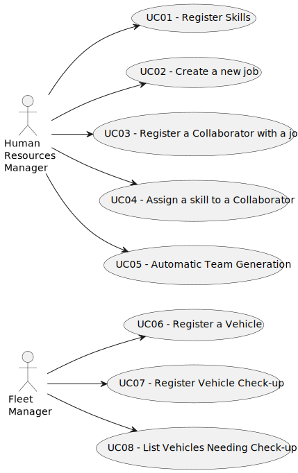

# Use Case Diagram (UCD)

**In the scope of this project, there is a direct relationship of _1 to 1_ between Use Cases (UC) and User Stories (US).**

However, be aware, this is a pedagogical simplification. On further projects and course units there may also exist _1 to N **and/or** N to 1_ relationships between UC and US.

**Insert below the Use Case Diagram in a SVG format**

**For each UC/US, it must be provided evidences of applying main activities of the software development process (requirements, analysis, design, tests and code). Gather those evidences on a separate file for each UC/US and set up a link as suggested below.**

# Use Cases / User Stories

| UC/US | Description                                                 |                   
|:------|:------------------------------------------------------------|
| US001 | [Register Skills](../../us001/Readme.md)                    |
| US002 | [Create a new job](../../us002/Readme.md)                   |
| US003 | [Register a Collaborator with a Job](../../us003/Readme.md) |
| US004 | [Assign a skill to a Collaborator](../../us004/Readme.md)   |
| US005 | [Automatic Team Generation](../../us005/Readme.md)          |
| US006 | [Register a Vehicle](../../us006/Readme.md)                 |
| US007 | [Register Vehicle Check-up](../../us007/Readme.md)          |
| US008 | [List Vehicles Needing Check-up](../../us008/Readme.md)     |