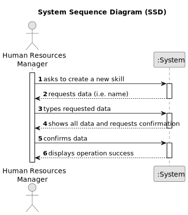

# US001 - Register Skills

## 1. Requirements Engineering

### 1.1. User Story Description

As a Human Resources Manager (HRM), I want to register skills that may be appointed to a collaborator.

### 1.2. Customer Specifications and Clarifications 

**From the specifications document:**

>	Each worker has a set of skills that enable him to perform/take on certain tasks/responsibilities, for example, driving vehicles of different types (e.g. light, or heavy), operating machines such as backhoes or tractors; tree pruning; application of phytopharmaceuticals

**From the client clarifications:**

> **Question:** Which information can be introduced to create a new skill?
>
> **Answer:** The skill name.

> **Question:** Which are the skills accepted? Or should we enable the HRM to introduce anything as a skill?
>
> **Answer:** All, it's up to HRM to decide. (special characters or algarisms should not be allowed in the skill name).

### 1.3. Acceptance Criteria

* **AC1:** The skill must be successfully registered and recorded in the system.
* **AC2:** The skill name must not have special characters.

### 1.4. Found out Dependencies

* None

### 1.5 Input and Output Data

**Input Data:**

* Typed data:
    * a name

**Output Data:**

* (In)Success of the operation

### 1.6. System Sequence Diagram (SSD)

### 1.7 Other Relevant Remarks

* None