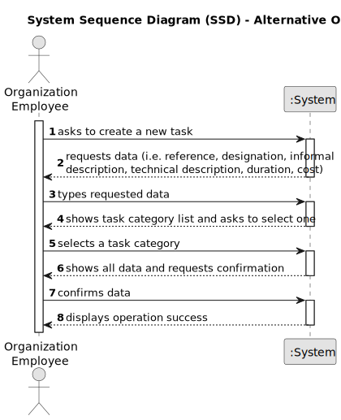

# US002 - Create a new job 

## 1. Requirements Engineering

### 1.1. User Story Description

As a human resources manager, I want to create a new profession to expand our company and satisfy the market.

### 1.2. Customer Specifications and Clarifications 

**From the specifications document:**

>	Each task is characterized by having a unique reference per organization, a designation, an informal and a technical description, an estimated duration and cost, as well as a task category. 

>	As long as it is not published, access to the task is exclusive to the employees of the respective organization. 

**From the client clarifications:**

> **Question:** What are the input data for creating a job??
>
> **Answer:**  Name of job.

> **Question:** Each job vacancy needs to be linked to a specific area or sector?
>
> **Answer:**  It is not essential, as there are no User Stories indicating the need for this association at the moment.

### 1.3. Acceptance Criteria
* **AC1:** A job is registered successfully.
* 

### 1.4. Found out Dependencies

* There is a dependency on "US003 - Create a task category" as there must be at least one task category to classify the task being created.

### 1.5 Input and Output Data

**Input Data:**

* Typed data:
    * a reference
    * a designation 
    * an informal description
    * a technical description
    * an estimated duration
    * an estimated cost
	
* Selected data:
    * a task category 

**Output Data:**

* List of existing task categories
* (In)Success of the operation

### 1.6. System Sequence Diagram (SSD)

#### Main Solution

### 1.7 Other Relevant Remarks

* The created task stays in a "not published" state in order to distinguish from "published" tasks.