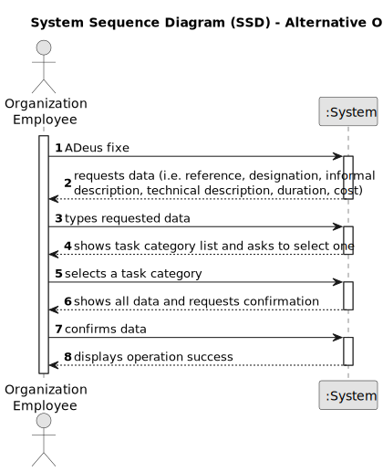

# US003 - Register a collaborator with a job. 

## 1. Requirements Engineering

### 1.1. User Story Descriptionc

As an HRM, I want to register a collaborator with a job and fundamental
characteristics.
### 1.2. Customer Specifications and Clarifications 

**From the specifications document:**

>	Each task is characterized by having a unique reference per organization, a designation, an informal and a technical description, an estimated duration and cost, as well as a task category. 

>	As long as it is not published, access to the task is exclusive to the employees of the respective organization. 

**From the client clarifications:**

> **Question:** What characteristics are important to success the register?
>
> **Answer:** Name, birthdate, admission date, address, contact info (mobile and email), taxpayer number, ID doc type and respective number

> **Question:** When creating a collaborator with an existing name ... What the system do?
>
> **Answer:** It's not common and most improbable to have different individual with same name in the same context, however it’s ID documentation number should be unique for sure.       

### 1.3. Acceptance Criteria

* **AC1:** name, birthdate, admission date, address, contact info (mobile and
  email), ID doc type and respective number should be provided by HRM
* **AC2:** 
* **AC3:** 

### 1.4. Found out Dependencies

* There is a dependency on "US002 - Register a job" as there must be a job registered to be associated with the collaborator

### 1.5 Input and Output Data

**Input Data:**

* Typed data:
    * a reference
    * a designation 
    * an informal description
    * a technical description
    * an estimated duration
    * an estimated cost
	
* Selected data:
    * a task category 

**Output Data:**

* List of existing task categories
* (In)Success of the operation

### 1.6. System Sequence Diagram (SSD)

**_Other alternatives might exist._**

#### Alternative One

#### Alternative Two

### 1.7 Other Relevant Remarks

* The created task stays in a "not published" state in order to distinguish from "published" tasks.