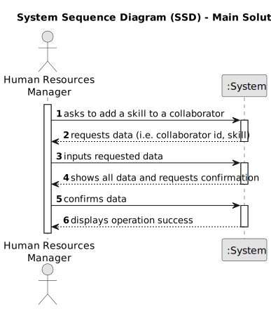

# US004 - Create a Task 

## 1. Requirements Engineering

### 1.1. User Story Description

As a Human Resources Manager (HRM), I want to assign skills to collaborators in order to efficiently manage their skill sets within the organization.

### 1.2. Customer Specifications and Clarifications 

**From the specifications document:**

>	Each skill assignment includes selecting a collaborator from the existing list, specifying the skill(s) to assign, and recording the assignment in the system.

**From the client clarifications:**

> **Question:** What permissions are required for the HRM to assign skills to collaborators?
>
> **Answer:** The HRM must have the necessary permissions to access and use the skill assignment feature.

### 1.3. Acceptance Criteria

* **AC1:** The HRM must be logged into the management system.
* **AC2:** Collaborators must already exist in the system.
* **AC3:** The HRM must have the necessary permissions to assign skills to collaborators.
* **AC4:** The collaborator's skill set is updated with the assigned skill(s).

### 1.4. Found out Dependencies

* There is a dependency on "US004 - Assign one or more skills to a collaborator" as there must be existing collaborators in the system for skill assignments to occur.

### 1.5 Input and Output Data

**Input Data:**

* Selected data:
    * HRM's selection of collaborator
    * Specification of skill(s) to assign

**Output Data:**

* Success or failure message indicating the outcome of the assignment operation

### 1.6. System Sequence Diagram (SSD)

