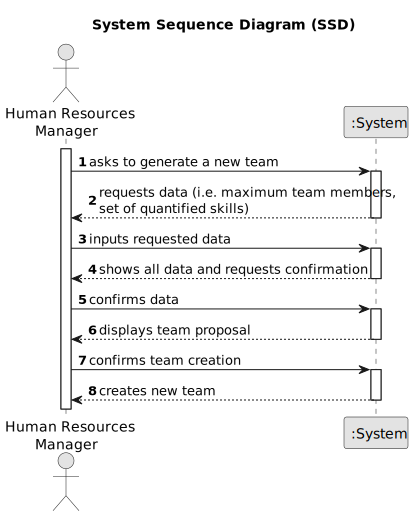

# US005 - Automatic Team Generation

## 1. Requirements Engineering

### 1.1. User Story Description

As an HRM, I want to generate a team proposal automatically.

### 1.2. Customer Specifications and Clarifications 

**From the specifications document:**

>	Teams are temporary associations of employees who will carry out a set of tasks in
one or more green spaces. When creating multipurpose teams, the number of members
and the set of skills that must be covered are crucial.

**From the client clarifications:**

> **Question:** What are the input data to automatically generate a team?
>
> **Answer:**
The customer provide the max size of the team and a set of skills.

> **Question:** What should the output of the automation be?
>
> **Answer:** The systems provide team proposals and HRM can accept of refuse the proposals.

### 1.3. Acceptance Criteria

* **AC1:** The maximum team size and the set of skills need to be supplied by
  the HRM.

### 1.4. Found out Dependencies

* US005 depends on US004, as it requires collaborators with assigned skills.

### 1.5 Input and Output Data

**Input Data:**

* Typed data:
    * a number
* Selected data:
  * set of quantified skills

**Output Data:**

* Team proposal
* (In)Success of the operation

### 1.6. System Sequence Diagram (SSD)

#### Main Path

### 1.7 Other Relevant Remarks

* The created task stays in a "not published" state in order to distinguish from "published" tasks.