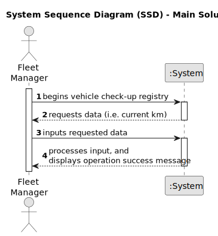

# US007 - Register Vehicle Check-up

## 1. Requirements Engineering

### 1.1. User Story Description

As a Fleet Manager (FM), I wish to register a vehicle’s check-up.

### 1.2. Customer Specifications and Clarifications 

**From the specifications document:**

> Vehicles are needed to carry out the tasks assigned to the teams as well as to transport machines and equipment. This type of vehicle can be only for passengers or mixed, light or heavy, open box or closed vans or trucks.

**From the client clarifications:**

> **Question:** What information is necessary when registering a vehicle's checkup?
>
> **Answer:** Plate number, date, and kms at checkup.

### 1.3. Acceptance Criteria

* **AC1:** Checkup is successfully registered
* **AC2:** Count of kms at last checkup of the specified vehicle is updated.

### 1.4. Found out Dependencies

* There is a dependency on "US006 - Register a Vehicle" as vehicles need to be registered in the system before their check-ups can be recorded.

### 1.5 Input and Output Data

**Input Data:**
	
* Typed data:
    * Plate number
    * Date
    * Current kms

**Output Data:**

* Success or failure message indicating the outcome of the registration operation

### 1.6. System Sequence Diagram (SSD)

### 1.7 Other Relevant Remarks

* None