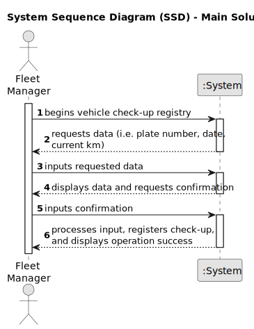

# US007 - Register Vehicle Check-up

## 1. Requirements Engineering

### 1.1. User Story Description

As a Facilities Manager (FM), I wish to register a vehicle's check-up to ensure timely maintenance and adherence to safety standards.

### 1.2. Customer Specifications and Clarifications 

**From the specifications document:**

> Each vehicle check-up registration involves recording details such as vehicle identification, date of check-up, maintenance tasks performed, and any notes related to the vehicle's condition.

**From the client clarifications:**

> **Question:** What permissions are required for the FM to register a vehicle's check-up?
>
> **Answer:** The FM must have appropriate permissions to access and utilize the vehicle check-up registration feature.

### 1.3. Acceptance Criteria

* **AC1:** The FM must be logged into the management system.
* **AC2:** Vehicles must already be registered within the system.
* **AC3:** The FM must have the necessary permissions to register vehicle check-ups.
* **AC4:** Upon registration, the system must record details including vehicle identification, date of check-up, maintenance tasks performed, and any additional notes.
* **AC5:** he system must provide feedback confirming the successful registration of the vehicle check-up.

### 1.4. Found out Dependencies

* There is a dependency on "US006 - Register a Vehicle" as vehicles need to be registered in the system before their check-ups can be recorded.

### 1.5 Input and Output Data

**Input Data:**
	
* Selected or typed data:
    * Vehicle identification
    * Date of check-up

**Output Data:**

* Success or failure message indicating the outcome of the registration operation

### 1.6. System Sequence Diagram (SSD)

### 1.7 Other Relevant Remarks

* None