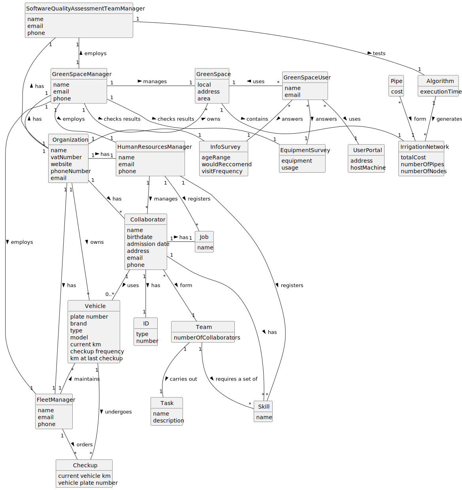

# OO Analysis

The construction process of the domain model is based on the client specifications, especially the nouns (for _concepts_) and verbs (for _relations_) used.

## Rationale to identify domain conceptual classes
To identify domain conceptual classes, start by making a list of candidate conceptual classes inspired by the list of categories suggested in the book "Applying UML and Patterns: An Introduction to Object-Oriented Analysis and Design and Iterative Development".

### _Conceptual Class Category List_

**Green Space**

* local
* address
* area

---

**Organization**

* name
* vatNumber
* website
* phoneNumber
* email

---

**Vehicle**

* plate number
* brand
* type
* model
* current km
* checkup frequency
* km at last checkup

---

**Checkup**

* current vehicle km
* vehicle plate number

---  

**Fleet Manager**

* name
* email
* phone

---

**Human Resources Manager**

* name
* email
* phone

---

**Green Space Manager**

* name
* email
* phone

---

**Green Space User**

* name
* email

---

**Collaborator**

* name
* birthdate
* admission date
* address
* email
* phone

---

**ID**

* type
* number

---

**Job**

* name

---

**Skill**

* name

---

**Team**

* number of collaborators

---

**Task**

* name
* description

---

## Rationale to identify associations between conceptual classes

An association is a relationship between instances of objects that indicates a relevant connection and that is worth of remembering, or it is derivable from the List of Common Associations:

- **_A_** is physically or logically part of **_B_**
- **_A_** is physically or logically contained in/on **_B_**
- **_A_** is a description for **_B_**
- **_A_** known/logged/recorded/reported/captured in **_B_**
- **_A_** uses or manages or owns **_B_**
- **_A_** is related with a transaction (item) of **_B_**
- etc.

| Concept (A) 		             |      Association   	      |             Concept (B) |
|----------------------------|:-------------------------:|------------------------:|
| Organization  	            |        has    		 	        |            Collaborator |
| Organization  	            |        has    		 	        |           Fleet Manager |
| Organization  	            |        has    		 	        | Human Resources Manager |
| Organization  	            |        has    		 	        |     Green Space Manager |
| Organization  	            |       owns    		 	        |             Green Space |
| Organization  	            |       owns    		 	        |                 Vehicle |
| Green Space Manager  	     |      manages    		 	      |             Green Space |
| Green Space Manager  	     |      employs    		 	      |           Fleet Manager |
| Green Space Manager  	     |      employs    		 	      | Human Resources Manager |
| Green Space User  	        |       uses    		 	        |             Green Space |
| Vehicle  	                 |     undergoes    		 	     |                 Checkup |
| Human Resources Manager  	 |      manages    		 	      |            Collaborator |
| Human Resources Manager  	 |     registers    		 	     |                   Skill |
| Human Resources Manager  	 |     registers    		 	     |                     Job |
| Fleet Manager  	           |      orders    		 	       |                 Checkup |
| Fleet Manager  	           |     maintains    		 	     |                 Vehicle |
| Collaborator  	            |        has    		 	        |                   Skill |
| Collaborator  	            |        has    		 	        |                     Job |
| Collaborator  	            |        has    		 	        |                      ID |
| Collaborator  	            |       form    		 	        |                    Team |
| Team  	                    |    carries out    		 	    |                    Task |
| Team  	                    | requires a set of    		 	 |                   Skill |

## Domain Model

**Do NOT forget to identify concept atributes too.**

**Insert below the Domain Model Diagram in a SVG format**

