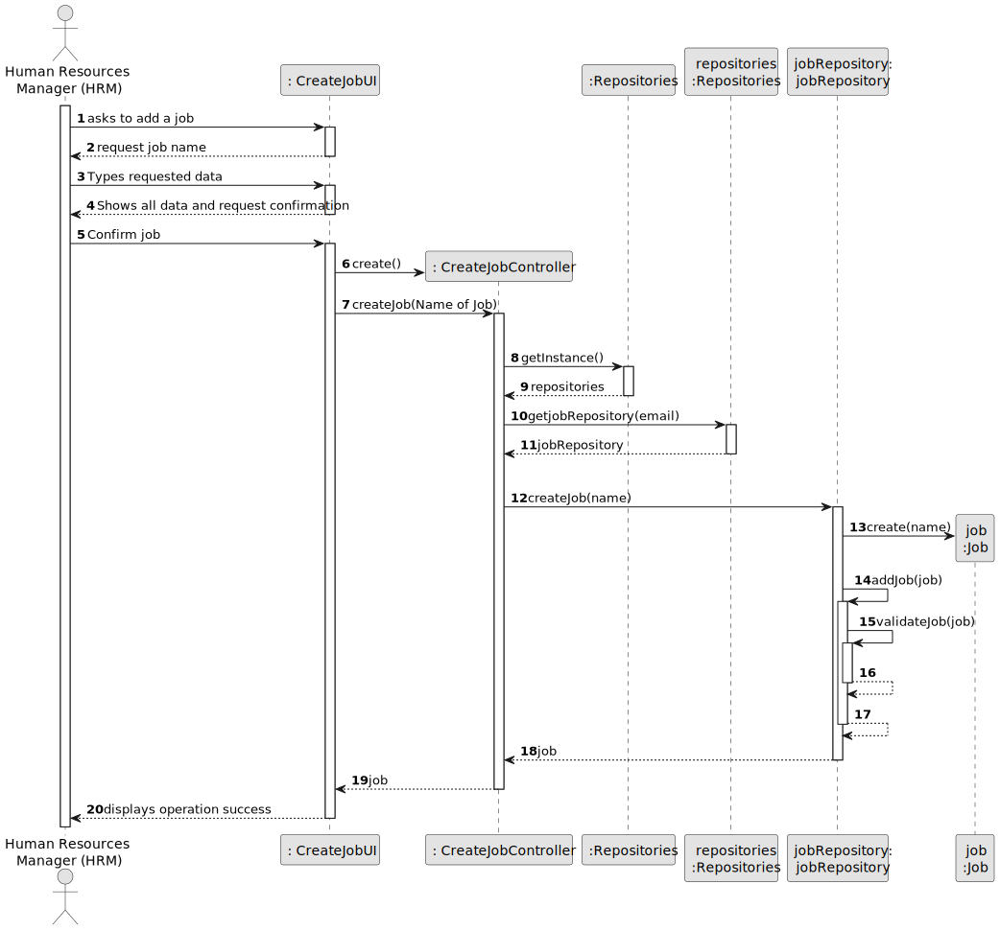

# US002 - Register a new job

## 3. Design - User Story Realization

### 3.1. Rationale

_**Note that SSD - Alternative One is adopted.**_

| Interaction ID | Question: Which class is responsible for...                                        | Answer                | Justification (with patterns)                                                                                                                              |
|:---------------|:-----------------------------------------------------------------------------------|:----------------------|:-----------------------------------------------------------------------------------------------------------------------------------------------------------|
| Step 1         | ... interacting with the actor?                                                    | RegisterJobUI         | Pure Fabrication: there is no reason to assign this responsibility to any existing class in the Domain Model.                                              |
|                | ... coordinating the US?                                                           | RegisterJobController | Controller: Coordinates interactions related to registering new work in the user interface (UI) and executes the logic necessary to process these requests |
| Step 2         |                                                                                    |                       |                                                                                                                                                            |
| Step 3         | ... temporarily storing the input data?                                            | RegisterJobUI         | Pure Fabrication: there is no reason to assign this responsibility to any existing class in the Domain Model.                                              |
| Step 4         | ... displaying all the information before submitting?                              | RegisterJobUI         | Pure Fabrication: there is no reason to assign this responsibility to any existing class in the Domain Model.                                              |
| Step 5         | ... creating the Job object?                                                       | JobRepository         | Creator: has the necessary data and records all jobs                                                                                                       |                       |                                                                                                                                                                             |                                                                                                   |
|                | ... validating the data locally?                                                   | Job                   | IE: owns its data.                                                                                                                                         |
|                | ... adding the data to a collection and validating duplicates (global validation)? | JobRepository         | IE: knows all jobs.                                                                                                                                        |
| Step 6         | ... informing operation success?                                                   | RegisterJobUI         | Pure Fabrication: there is no reason to assign this responsibility to any existing class in the Domain Model.                                              |

### Systematization ##

According to the taken rationale, the conceptual classes promoted to software classes are:

* Job

Other software classes (i.e. Pure Fabrication) identified:

* RegisterJobUI  
* RegisterJobController
* Job Repository

## 3.2. Sequence Diagram (SD)

_**Note that SSD - Alternative Two is adopted.**_

### Full Diagram

This diagram shows the full sequence of interactions between the classes involved in the realization of this user story.

## 3.3. Class Diagram (CD)

