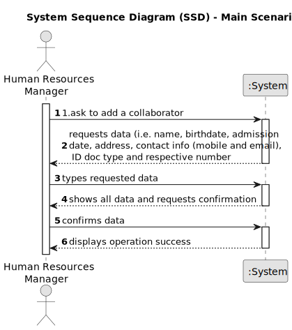

# US003 - Register a collaborator with a job. 

## 1. Requirements Engineering

### 1.1. User Story Description 

As an HRM, I want to register a collaborator with a job and fundamental
characteristics.

### 1.2. Customer Specifications and Clarifications  

**From the specifications document:**

> Some job examples are designer, budgetist,gardener, electrician or bricklayer. Thus, an employee has a main occupation (job) and  a set of skills that enable him to perform/take on certain tasks/responsibilities, for example, driving vehicles of different types (e.g. light, or heavy), operating machines such as backhoes or tractors; tree pruning; application of agriculture phytopharmaceuticals.

> Tasks are carried out on an occasional or regular basis in one or more green spaces, for example: tree pruning; installation of an irrigation system; installation of a lighting system.

**From the client clarifications:**

> **Question:** What characteristics are important to success the register?
>
> **Answer:** Name, birthdate, admission date, address, contact info (mobile and email), taxpayer number, ID doc type and respective number

> **Question:** When creating a collaborator with an existing name ... What does the system do?
>
> **Answer:** It's not common and most improbable to have different individual with same name in the same context, however it’s ID documentation number should be unique for sure.       

### 1.3. Acceptance Criteria

* **AC1:** The collaborator must be registered in the system

### 1.4. Found out Dependencies

* There is a dependency on "US002 - Register a job" as there must be a job registered to be associated with the collaborator

### 1.5 Input and Output Data

**Input Data:**

* Typed data:
    * a name
    * a birthdate 
    * an admission date
    * an address
    * contact info (mobile and email)
    * an ID doc type
    * an ID doc number

* Selected data:
  * Job

**Output Data:**

* (In)Success of the operation

### 1.6. System Sequence Diagram (SSD)

### 1.7 Other Relevant Remarks

* None