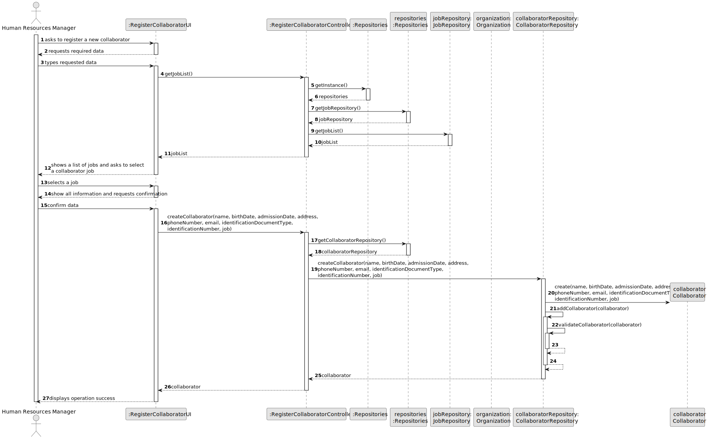
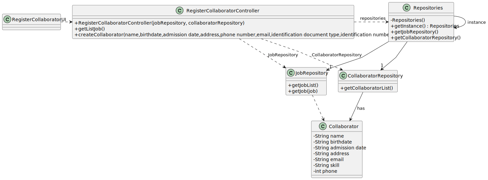

# US003 - Register a collaborator with a job.

## 3. Design - User Story Realization 

### 3.1. Rationale

_**Note that SSD - Alternative One is adopted.**_

| Interaction ID | Question: Which class is responsible for...              | Answer                         | Justification (with patterns)                                                                                                                              |
|:---------------|:---------------------------------------------------------|:-------------------------------|:-----------------------------------------------------------------------------------------------------------------------------------------------------------|
| Step 1  		     | 	... interacting with the actor?                         | RegisterCollaboratorUI         | Pure Fabrication: there is no reason to assign this responsibility to any existing class in the Domain Model.                                              |
| 			  		        | 	... coordinating the US?                                | RegisterCollaboratorController | Controller: Coordinates the interactions related to add a collaborator in the user interface (UI) and executes the logic needed to process these requests. |
| 		             | 	... displaying the form for the user to input data?				 | RegisterCollaboratorUI         | Pure Fabrication: there is no reason to assign this responsibility to any existing class in the Domain Model.                                              |
| Step 2		       | 					                                                    |                                |                                                                                                                                                            |
| Step 3		       | 	... knowing the job list?				                           | JobRepository                  | IE: registers all jobs.                                                                                                                                    |
| Step 4		       | 					                                                    |                                |                                                                                                                                                            |
| Step 5		       | 	... storing the selected job temporarily?				           | RegisterCollaboratorUI         | Pure Fabrication: there is no reason to assign this responsibility to any existing class in the Domain Model.                                              |
| Step 6  		     | 	...displaying all the data?                             | RegisterCollaboratorUI         | IE: Keeps all information before submission.                                                                                                               |
| 		             | 	...requesting confirmation?                             | RegisterCollaboratorUI         | IE: Is responsible for user interactions.                                                                                                                  |
| Step 7  		     | 	...saving all data?                                     | Collaborator                   | IE: Has its own data.                                                                                                                                      |
| 		             | ... creating the new Collaborator object?   	            | CollaboratorsRepository        | Creator                                                                                                                                                    |
| 		             | 		... validating all data (local validation)?						      | Collaborator                   | IE: Has its own data.                                                                                                                                      |              
| 			  		        | 	... validating all data (global validation)?            | CollaboratorRepository         | IE: knows all collaborators.                                                                                                                               | 
| Step 8			  		  | 	... informing operation success?                        | RegisterCollaboratorUI         | IE: Is responsible for user interactions.                                                                                                                  | 

### Systematization ##

According to the taken rationale, the conceptual classes promoted to software classes are: 

* Collaborator

Other software classes (i.e. Pure Fabrication) identified: 

* RegisterCollaboratorUI  
* RegisterCollaboratorController

## 3.2. Sequence Diagram (SD)

_**Note that SSD - Alternative Two is adopted.**_

### Full Diagram

This diagram shows the full sequence of interactions between the classes involved in the realization of this user story.

## 3.3. Class Diagram (CD)

