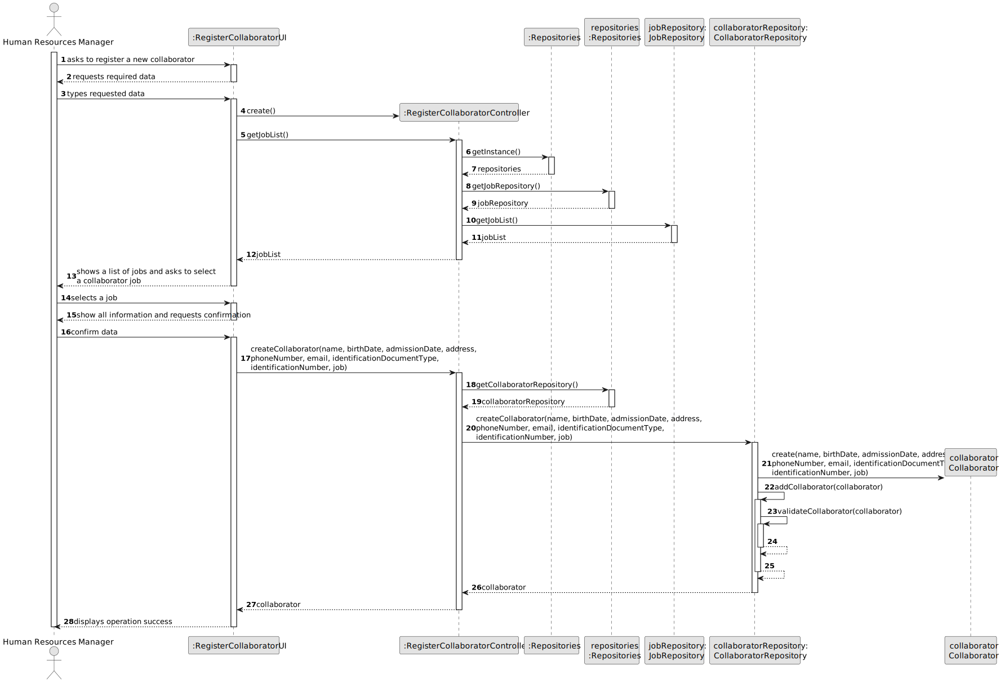
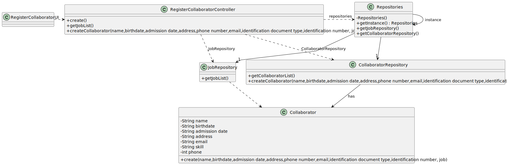

# US003 - Register a collaborator with a job.

## 3. Design - User Story Realization 

### 3.1. Rationale

_**Note that SSD - Alternative One is adopted.**_

| Interaction ID | Question: Which class is responsible for...                                     | Answer                         | Justification (with patterns)                                                                                                                                                                                      |
|:---------------|:--------------------------------------------------------------------------------|:-------------------------------|:-------------------------------------------------------------------------------------------------------------------------------------------------------------------------------------------------------------------|
| Step 1  		     | 	... interacting with the actor?                                                | RegisterCollaboratorUI         | Pure Fabrication: there is no reason to assign this responsibility to any existing class in the Domain Model.                                                                                                      |
| 			  		        | 	... coordinating the US?                                                       | RegisterCollaboratorController | Controller:coordinates the interactions related to add a collaborator in the user interface (UI) and executes the logic needed to process these requests.                                                          |
| Step 2  		     | 	... displaying the form for the user to imput data?				                        | RegisterCollaboratorUI         | IE: Is responsible for interacting with the actor.                                                                                                                                                                 |
| Step 3		       | 	... knowing the job?				                                                       | JobRepository                  | IE: owns all its jobs.                                                                                                                                                                                             |
| 		             | 	   ... saving selected job?                                                    | RegisterCollaboratorUI         | IE: RegisterCollaborator manages the selected job data.                                                                                                                                                            |
|                | ... knowing the collaborator?                                                   | CollaboratorsRepository        | IE: owns all its collaborators.                                                                                                                                                                                    |                                                                   
| 		             | ... saving selected collaborator?   	                                           | RegisterCollaboratorUI         | IE: RegisterCollaborator manages the selected collaborator data.                                                                                                                                                   |
| Step 4  		     | 	...displaying all the data?                                                    | RegisterCollaboratorUI         | IE: Keeps all information before submission.                                                                                                                                                           |
| 		             | 	...requesting confirmation?                                                    | RegisterCollaboratorUI         | IE: Is responsible for user interactions.                                                                                                                                                           |
| Step 5  		     | 	...saving all data?                                                            | Collaborator                   | IE: Has its own data.                                                                                                                                          |
| 		             | 		... validating all data (local validation)?						                             | Collaborator                   | IE: Has its own data.                                                                                                                                                                                                                                    |              
| 			  		        | 	... validating all data (global validation)?                                   | CollaboratorRepository         | IE: knows all check-ups.                                                                                                                                                                                           | 
| Step 6			  		  | 	... informing operation success?                                               | RegisterCollaboratorUI         | IE: Is responsible for user interactions.                                                                                                                                                                                            | 

### Systematization ##

According to the taken rationale, the conceptual classes promoted to software classes are: 

* Organization
* Task

Other software classes (i.e. Pure Fabrication) identified: 

* CreateTaskUI  
* CreateTaskController

## 3.2. Sequence Diagram (SD)

_**Note that SSD - Alternative Two is adopted.**_

### Full Diagram

This diagram shows the full sequence of interactions between the classes involved in the realization of this user story.

## 3.3. Class Diagram (CD)

