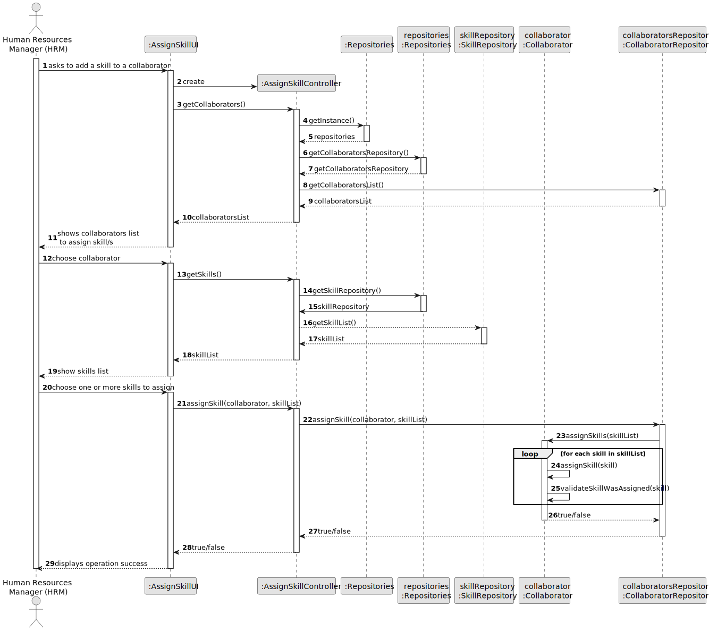
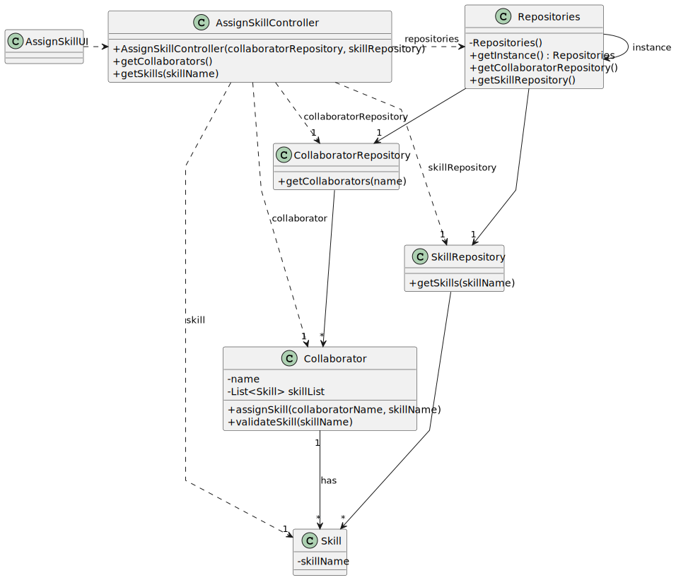

# US004 - Assign a skill to collaborator

## 3. Design - User Story Realization 

### 3.1. Rationale

_**Note that SSD - Alternative One is adopted.**_

| Interaction ID | Question: Which class is responsible for...           | Answer                 | Justification (with patterns)                                                                                                                                               |
|:--------------|:------------------------------------------------------|:-----------------------|:----------------------------------------------------------------------------------------------------------------------------------------------------------------------------|
| Step 1        | ... interacting with the actor?                       | AssignSkillUI          | Pure Fabrication: there is no reason to assign this responsibility to any existing class in the Domain Model.                                                               |
|               | ... coordinating the US?                              | AssignSkillController  | Controller: coordinates the interactions related to assigning a skill to a collaborator in the user interface (UI) and executes the logic needed to process these requests. |
| 	             | ... knowing the user using the system?                | UserSession            | IE: cf. A&A component documentation.                                                                                                                                        |
| Step 2        | ... getting the collaborator?                         | OrganizationRepository | IE: owns all its collaborators.                                                                                                                                             |
| Step 3        | ... saving selected collaborator?                     | AssignSkillUI          | IE: AssignSkill manages the selected collaborator data.                                                                                                                     |
| Step 4        | ... getting the skill/s?                              | SkillRepository        | IE: owns skills list.                                                                                                                                                       |                       |                                                                                                                                                                             |
| Step 6        | ... assigning skill to the selected collaborator?     | Organization           | IE: onws all collaborators information.                                                                                                                                     |
|               | ... validating all data (local validation)?           | Collaborator           | IE: owns its data.                                                                                                                                                          |
|               | ... validating all data (global validation)?          | Collaborator           | IE: knows all its collaborators.                                                                                                                                            |
|               | ... saving the new skills assigned to a collaborator? | Organization           | IE: owns all its collaborators.                                                                                                                                             |
| Step 8        | ... informing operation success?                      | AssignSkillUI          | IE: is responsible for user interactions.                                                                                                                                   |

### Systematization ##

According to the taken rationale, the conceptual classes promoted to software classes are:

* OrganizationRepository
* Collaborator

Other software classes (i.e. Pure Fabrication) identified:

* AssignSkillUI
* AssignSkillController

## 3.2. Sequence Diagram (SD)

_**Note that SSD - Alternative Two is adopted.**_

### Full Diagram

This diagram shows the full sequence of interactions between the classes involved in the realization of this user story.

## 3.3. Class Diagram (CD)

