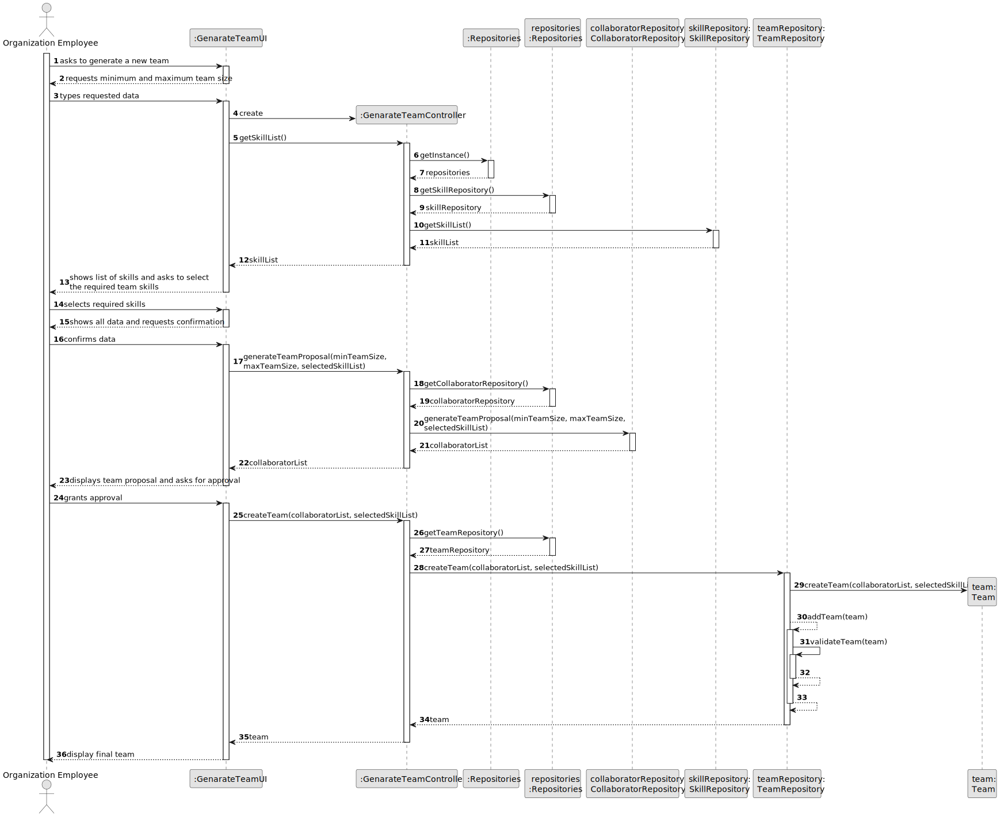

# US005 - Automatic Team Generation 

## 3. Design - User Story Realization 

### 3.1. Rationale

_**Note that SSD - Alternative One is adopted.**_

| Interaction ID | Question: Which class is responsible for...                | Answer                 | Justification (with patterns)                                                                                                                            |
|:---------------|:-----------------------------------------------------------|:-----------------------|:---------------------------------------------------------------------------------------------------------------------------------------------------------|
| Step 1  		     | 	... interacting with the actor?                           | GenarateTeamUI         | Pure Fabrication: there is no reason to assign this responsibility to any existing class in the Domain Model.                                            |
| 			  		        | 	... coordinating the US?                                  | GenarateTeamController | Controller: coordinates the interactions related to genarate a team  in the user interface (UI) and executes the logic needed to process these requests. |
| Step 2  		     | 	... displaying the form for the user to imput data?						 | GenarateTeamUI         | Pure Fabrication: there is no reason to assign this responsibility to any existing class in the Domain Model.                                            |
| Step 3         | ... knowing the list of skills?                            | SkillRepository        | IE: records all the skills.                                                                                                                              |
| Step 7         | ... knowing the list of Collaborators?                     | CollaboratorRepository | IE: owns all its collaborators.                                                                                                                          |
|                | ... knowing each Collaborators' skills?                    | Collaborator           | IE: owns all its data.                                                                                                                                   |
|                | ... generating team proposals?                             | CollaboratorRepoistory | IE: records all collaborators, can access their skills, and has the processing capacity to calculate proposals.                                          |
| Step 4  		     | 	... displaying team proposal?                             | GenarateTeamUI         | Pure Fabrication: there is no reason to assign this responsibility to any existing class in the Domain Model.                                            |
| 		             | 	... requesting confirmation?                              | GenarateTeamUI         | Pure Fabrication: there is no reason to assign this responsibility to any existing class in the Domain Model.                                            |
| 	Step 9 		  	  | ... creating the new Team object?                          | TeamRepository         | Creator                                                                                                                                                  |
| 			  	         | 	... locally validating data?                              | Team                   | IE: owns all its data.                                                                                                                                   |
| 			  	         | 	... validating all data (global validation)?              | TeamRepository         | IE: knows all check-ups.                                                                                                                                 |
| Step 10  		    | 	... informing the user of operation success?              | GenarateTeamUI         | Pure Fabrication: there is no reason to assign this responsibility to any existing class in the Domain Model.                                            | 

### Systematization ##

According to the taken rationale, the conceptual classes promoted to software classes are: 

* Collaborator
* Team

Other software classes (i.e. Pure Fabrication) identified: 

* CreateTaskUI  
* CreateTaskController

## 3.2. Sequence Diagram (SD)

_**Note that SSD - Alternative Two is adopted.**_

### Full Diagram

This diagram shows the full sequence of interactions between the classes involved in the realization of this user story.

## 3.3. Class Diagram (CD)

