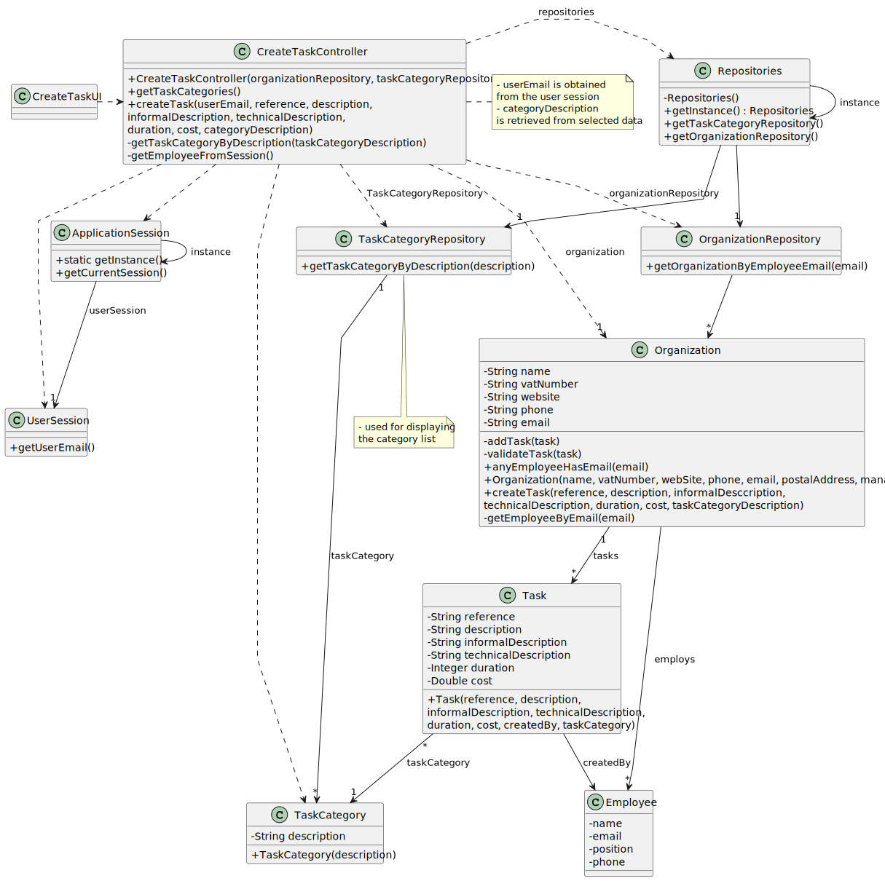

# US006 - Asks to register new vehicle

## 3. Design - User Story Realization 

### 3.1. Rationale

_**Note that SSD - Alternative One is adopted.**_

| Interaction ID | Question: Which class is responsible for...   | Answer                    | Justification (with patterns)                                                                                 |
|:-------------  |:----------------------------------------------|:--------------------------|:--------------------------------------------------------------------------------------------------------------|
| Step 1  		 | 	... interacting with the actor?              | RegisterVehicleUI         | Pure Fabrication: there is no reason to assign this responsibility to any existing class in the Domain Model. |
| 			  		 | 	... coordinating the US?                     | RegisterVehicleController | Controller                                                                                                    |
| 			  		 | 	... instantiating a new Vehicle?             | Repositories              | Creator (Rule 1): in the DM Organization has a Vehicle.                                                       |
| 			  		 | ... knowing the user using the system?        | Fleet Manager             | IE: cf. A&A component documentation.                                                                          |
| Step 2  		 | 							                                       |                           |                                                                                                               |
| Step 3  		 | 	...saving the inputted data?                 | Vehicle                   | IE: object created in step 1 has its own data.                                                                |
| Step 4  		 | ...knowing the vehicle types to show?         | Repositories              | IE: Vehicle Categories are defined by the Administrators.                                                     |
| Step 5  		 | 	... saving the selected category?            | Vehicle                   | IE: object created in step 1 is classified in one Type.                                                       |
| Step 7  		 | 	... validating all data (local validation)?  | Vehicle                   | IE: owns its data.                                                                                            | 
| 			  		 | 	... validating all data (global validation)? | Repositiories             | IE: knows all its vehicles.                                                                                   | 
| 			  		 | 	... saving the created vehicle?              | Repositories              | IE: owns all its vehicles.                                                                                    | 
| Step 8  		 | 	... informing operation success?             | RegisterVehicleUI              | IE: is responsible for user interactions.                                                                     | 

### Systematization ##

According to the taken rationale, the conceptual classes promoted to software classes are: 

* Repositories
* Vehicle

Other software classes (i.e. Pure Fabrication) identified: 

* RegisterVehicleUI 
* RegisterVehicleController

## 3.2. Sequence Diagram (SD)

_**Note that SSD - Alternative Two is adopted.**_

### Full Diagram

This diagram shows the full sequence of interactions between the classes involved in the realization of this user story.

## 3.3. Class Diagram (CD)

