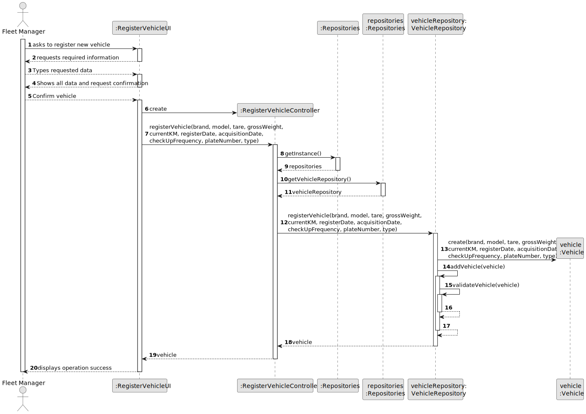

# US006 - Asks to register new vehicle

## 3. Design - User Story Realization 

### 3.1. Rationale

_**Note that SSD - Alternative One is adopted.**_

| Interaction ID | Question: Which class is responsible for...   | Answer             | Justification (with patterns)                                                                                 |
|:---------------|:----------------------------------------------|:-------------------|:--------------------------------------------------------------------------------------------------------------|
| Step 1  		     | 	... interacting with the actor?              | RegisterVehicleUI  | Pure Fabrication: there is no reason to assign this responsibility to any existing class in the Domain Model. |
| 			  		        | 	... coordinating the US?                     | RegisterVehicleUI  | Controller                                                                                                    ||
| 	              | ...knowing the vehicle types to show?         | VehicleRepository  | IE: Vehicle Categories are defined by the Administrators.                                                     |
| Step 2		       | 	... validating all data (local validation)?  | VehicleRepository  | IE: owns its data.                                                                                            | 
| 			  		        | 	... validating all data (global validation)? | VehicleRepositiory | IE: knows all its vehicles.                                                                                   | 
| 			  		        | 	... saving the created vehicle?              | VehicleRepository  | IE: owns all its vehicles.                                                                                    | 
|   		           | 	... informing operation success?             | RegisterVehicleUI  | IE: is responsible for user interactions.                                                                     | 

### Systematization ##

According to the taken rationale, the conceptual classes promoted to software classes are: 

* VehicleRepository

Other software classes (i.e. Pure Fabrication) identified: 

* RegisterVehicleUI 
* RegisterVehicleController

## 3.2. Sequence Diagram (SD)

_**Note that SSD - Alternative Two is adopted.**_

### Full Diagram

This diagram shows the full sequence of interactions between the classes involved in the realization of this user story.

## 3.3. Class Diagram (CD)

