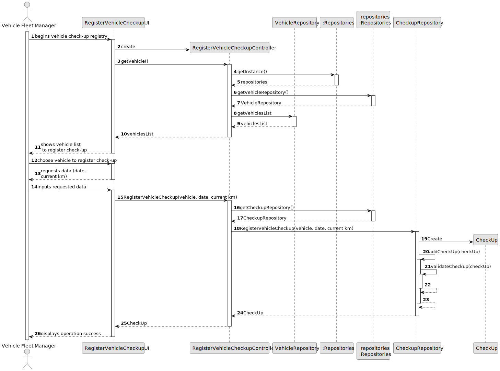

# US007 - Register Vehicle Check-up

## 3. Design - User Story Realization 

### 3.1. Rationale

_**Note that SSD - Alternative One is adopted.**_

| Interaction ID  | Question: Which class is responsible for...        | Answer                                       | Justification (with patterns)                                                                                 |
|:----------------|:---------------------------------------------------|:---------------------------------------------|:--------------------------------------------------------------------------------------------------------------|
| Step 1  		      | 	... interacting with the actor?                   | RegisterVehicleCheckupUI                     | Pure Fabrication: there is no reason to assign this responsibility to any existing class in the Domain Model. |
| 			             | 	... coordinating the US?                          | RegisterVehicleCheckupController             | Controller                                                                                                    |
| Step 2  		      | ...displaying the form for the user to imput data? | RegisterVehicleCheckupUI                     | IE: Is responsible for interacting with the actor.                                                            |
| Step 3  		      | 	...temporarily saving the inputted data?          | RegisterVehicleCheckupUI                     | IE: Is responsable for saving the imputed data temporarily.                                                   |
| Step 4  		      | 	...displaying all the data?                       | RegisterVehicleCheckupUI                     | IE: Keeps all information before submission.                                                                  |
| 		              | 	...requesting confirmation?                       | RegisterVehicleCheckupUI                     | IE: Is responsible for user interactions.                                                                     |
| Step 5  		      | 	... instantiating a new Vehicle Check-up?         | VehicleRepository                            | IE: Is responsible for registering a check-up.                                                                |
| 			  	          | ...saving all data?                                | CheckUp                                      | IE: Has its own data.                                                                                         |
| 			  	          | 	... validating all data (local validation)?       | Checkup                                      | IE: owns all its data.                                                                                        |
| 			  	          | 	... validating all data (global validation)?      | Vehicle                                      | IE: knows all check-ups.                                                                                      |
| 			  	          | 	... saving the Created Check-up?                  | CheckupRepository                            | IE: owns all check-ups.                                                                                       |
| Step 6  		      | 	... informing operation success?                  | RegisterVehicleCheckupUI                     | IE: is responsible for user interactions.                                                                     |
### Systematization ##

According to the taken rationale, the conceptual classes promoted to software classes are: 

* CheckUp
* Vehicle

Other software classes (i.e. Pure Fabrication) identified: 

* RegisterVehicleCheckupUI
* RegisterVehicleCheckupController
* VehicleRepository
## 3.2. Sequence Diagram (SD)

_**Note that SSD - Alternative Two is adopted.**_

### Full Diagram

This diagram shows the full sequence of interactions between the classes involved in the realization of this user story.

## 3.3. Class Diagram (CD)

