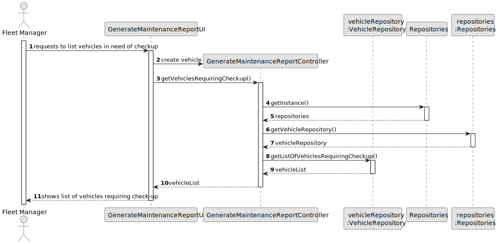

# US008 - List Vehicles Needing Check-up

## 3. Design - User Story Realization

### 3.1. Rationale

_**Note that SSD - Alternative One is adopted.**_

| Interaction ID  | Question: Which class is responsible for... | Answer                              | Justification (with patterns)                                                                                 |
|:----------------|:--------------------------------------------|:------------------------------------|:--------------------------------------------------------------------------------------------------------------|
| Step 1  		      | 	... interacting with the actor?            | GenerateMaintenanceReportUI         | Pure Fabrication: there is no reason to assign this responsibility to any existing class in the Domain Model. |
| 			             | 	... coordinating the US?                   | GenerateMaintenanceReportController | Controller                                                                                                    |
| Step 2  		      | ...retrieving vehicles needing maintenance? | VehicleRepository                   | IE: Contains data and methods to retrieve vehicles needing maintenance.                                                            |
| 	               | 	...formatting the report data?             | MaintenanceReportFormatter          | IE: Formats report data as per requirements.                                                   |
| 	        Step 3 | 	...generating the Maintenance Report?      | MaintenanceReport                   | IE: Responsible for creating instances of the Maintenance Report.                                                                  |
| 		 Step 4       | 	...validating the report data              | MaintenanceReportValidator          | IE: Manages validation of report data.                                                                     |
| Step 5          | 	... saving the generated report            | MaintenanceReportRepository         | IE:Persists generated Maintenance Report.                                                                |
| 		Step 6	  	    | ...notifying the user of success            | GenerateMaintenanceReportUI         | IE:Handles user notifications.                                                                                         |

### Systematization ##

According to the taken rationale, the conceptual classes promoted to software classes are:

* GenerateMaintenanceReportUI
* GenerateMaintenanceReportController
* VehicleRepository
* MaintenanceReportFormatter
* MaintenanceReport
* MaintenanceReportValidator
* MaintenanceReportRepository

Other software classes (i.e. Pure Fabrication) identified:

* None

## 3.2. Sequence Diagram (SD)

_**Note that SSD - Alternative Two is adopted.**_

### Full Diagram

This diagram shows the full sequence of interactions between the classes involved in the realization of this user story.

## 3.3. Class Diagram (CD)

