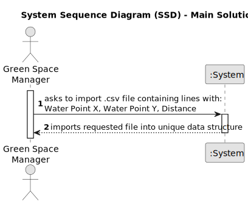

# US012 - Import Irrigation System Planning File

## 1. Requirements Engineering

### 1.1. User Story Description

As a Green Space Manager, I want to import a .csv file containing lines with: Water Point X, Water Point Y, Distance into a unique data structureAs a Fleet Manager, I want to describe all possible 

### 1.2. Customer Specifications and Clarifications

**From the specifications document:**

> The set of imported lines describes all possible routes that can be opened to lay pipes between each pair of water points, and their respective installation costs (these could simply refer to the length, or to any other cost parameter).

**From the client clarifications:**

* None

### 1.3. Acceptance Criteria

* **AC1:** The system successfully imports the .csv file containing water route data.
  **AC2:** The data structure accurately represents all possible routes between water points.
  **AC3**  Each route includes information on local water, distance and associated installation costs.

### 1.4. Found out Dependencies

* None

### 1.5 Input and Output Data

**Input Data:**

* .csv file containing water route data (Water Point X, Water Point Y, Distance, Installation Cost)

**Output Data:**

* (In)Success of the operation

### 1.6. System Sequence Diagram (SSD)

### 1.7 Other Relevant Remarks

* None