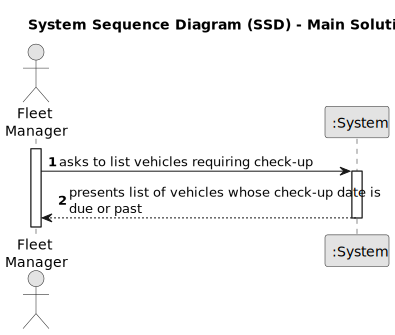

# US014 - Observe execution time of the US13 algorithm.
 

## 1. Requirements Engineering

### 1.1. User Story Description

As a QAM, I want to run tests for inputs of variable size, to  observe the asymptotic behavior of the execution time of the US13  algorithm.

### 1.2. Customer Specifications and Clarifications 

**From the specifications document:**

>

> 

**From the client clarifications:**

> **Question:** 
>
> **Answer:** 

> **Question:** 
>
> **Answer:** 

### 1.3. Acceptance Criteria

* **AC1:**  : The graphic referring to the asymptotic behavior of the execution running time tests should be presented in a time unit that allows to distinguish the running times of all tested examples.

### 1.4. Found out Dependencies

* There is a dependency on "US014 - ..." as there must be a correctly developed algorithm to be tested 

### 1.5 Input and Output Data

**Input Data:**

* 

**Output Data:**

*
### 1.6. System Sequence Diagram (SSD)

### 1.7 Other Relevant Remarks

* None