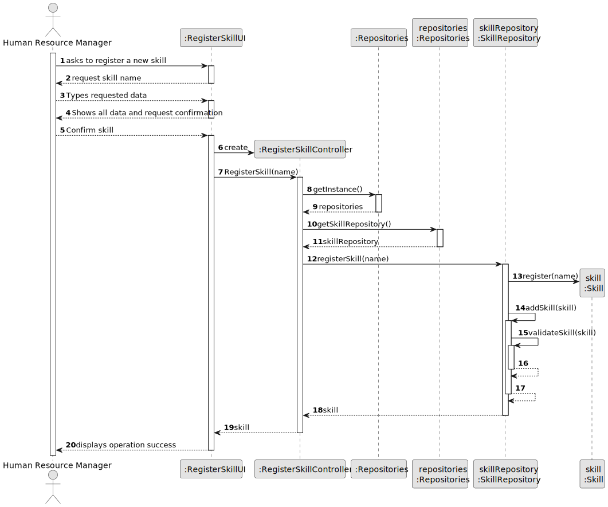
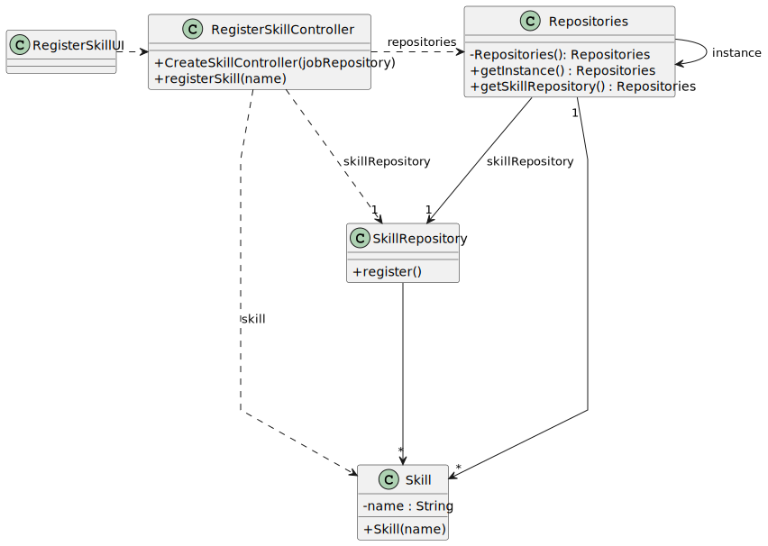

# US001 - Register Skills

## 3. Design - User Story Realization

### 3.1. Rationale

_**Note that SSD - Alternative One is adopted.**_

| Interaction ID | Question: Which class is responsible for... | Answer                  | Justification (with patterns)                                                                                                                                      |
|:---------------|:--------------------------------------------|:------------------------|:-------------------------------------------------------------------------------------------------------------------------------------------------------------------|
| Step 1         | ... interacting with the actor?             | RegisterSkillUI         | Pure Fabrication: there is no reason to assign this responsibility to any existing class in the Domain Model.                                                      |
|                | ... coordinating the US?                    | RegisterSkillController | Controller: Manages the communication involved in inputting skills into the user interface (UI) and carries out the necessary operations to handle these requests. |
|                | ... instantiating a new skill?              | SkillRepository         | Creator: the Organisation registers a Skill instance.                                                                                                              |
| Step 2         |                                             |                         |                                                                                                                                                                    |
| Step 3         | ... saving inputted data?                   | Skill                   | IE: object created in step 1 has its own data.                                                                                                                     |
| Step 4         |                                             |                         |                                                                                                                                                                    |
| Step 5         | ... validating all data (local validation)? | Skill                   | IE: owns data.                                                                                                                                                     |
|                | ... validate all data (global validation)?  | SkillRepository         | IE: knows all skills.                                                                                                                                              |
|                | ... saving the created skill?               | SkillRepository         | IE: owns all skills.                                                                                                                                               |
| Step 6         | ... informing operation success?            | RegisterSkillUI         | IE: is responsible for user interactions.                                                                                                                          |

### Systematization ##

According to the taken rationale, the conceptual classes promoted to software classes are:

* SkillRepository
* Skill

Other software classes (i.e. Pure Fabrication) identified:

* RegisterSkillUI
* RegisterSkillController

## 3.2. Sequence Diagram (SD)

_**Note that SSD - Alternative Two is adopted.**_

### Full Diagram

This diagram shows the full sequence of interactions between the classes involved in the realization of this user story.

## 3.3. Class Diagram (CD)

