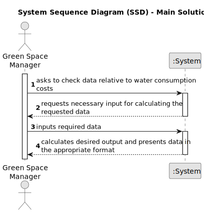

# US009 - Check Water Consumption Costs

## 1. Requirements Engineering

### 1.1. User Story Description

As a Green Space Manger, I want to know the exact costs referring to water consumption of specific green space.

### 1.2. Customer Specifications and Clarifications 

**From the specifications document:**

> The ”WaterUsed.csv” file provide the necessary data to carry out the study. This file records daily water consumption (in m3) since the day each park opened. The amount paid for water is 0.7 AC/m3, up to a consumption of 50 m3, with a fee of 15% added for higher consumption levels.

> The data file contains records of the following information: ”Park Identification”, ”Year”, ”Month”, ”Day”, ”Consumption”. Consider this data in order to obtain the following outcomes:

> Barplot representing monthly water consumption, as a result of the following specifications given by the user: time period (StartMonth, EndMonth) and park identification.

> Average of monthly costs related to water consumption as a result of the following specifications given by the user: number of parks to be analyzed, and park identification.

> Consider the water consumption of every day that is recorded. The aim is to analyze and compare statistical indicators between the park with the highest and lowest water consumption. For these two parks, perform the following tasks and compare results:

> Calculate the mean, median, standard deviation, and the coefficient of skewness;

> Build relative and absolute frequency tables (classified data), considering 5 classes;

> Check if the data has outliers, using the outlier definition as values that deviate from the median by more than 1.5 times the interquartile range;

> Graphically represent data through histograms with 10 classes.

**From the client clarifications:**

> **Question:** Does the file in which these costs are registered contain day-by-day data or data that we assume is constant every day?
>
> **Answer:** Day-by-day data.

> **Question:** There are various functionalities that this user story must accomplish. Are these separate, individual functions, or can they be grouped as the output of one single execution of this user story?
>
> **Answer:** Either solution works, so long as all the intended output data is available in some way.

> **Question:** Is there a limit on how long the period of time analyzed by this function can be?
>
> **Answer:** The outputs must discriminate the data by year in order to avoid outputs covering more than a year. The user must input the year they wish to see the data of.

### 1.3. Acceptance Criteria

* **AC1:** All output data is shown to the user, either separate as different functions or grouped into one global output.
* **AC2:** Data must discriminate year-by-year as to avoid outputs with data spanning more than a year.
* **AC3:** The calculations that use the start month and end month parameters must not use the plural park identification, and instead use the singular one.
* **AC4:** The calculations that use the number of parks to be analyzed must not use the singular park identification, and instead use the plural ones.
* **AC5:** The "singular park identification" parameter must identify one park, and one park only.
* **AC6:** The "plural park identification" must identify one or more different parks.
* **AC7:** The amount of parks identified by the plural park identification must be equal to the "number of parks to be analyzed" parameter.
* **AC8:** The "WaterUsed.csv" file is used to read the water consumption data necessary for all calculations.

### 1.4. Found out Dependencies

* None

### 1.5 Input and Output Data

**Input Data:**

* Selected data:
    * year
    * start month
    * end month
* Typed data:
    * singular park identification
    * plural park identification
    * number of parks to be analyzed

**Output Data:**

* Barplot representing monthly water consumption as a result of the time period between the start month and the end month, in the park specified by the singular park identification.
* Average of the monthly costs related to water consumption as a result of the number of parks to be analyzed in the parks identified by the plural park identification.

### 1.6. System Sequence Diagram (SSD)

### 1.7 Other Relevant Remarks

* None