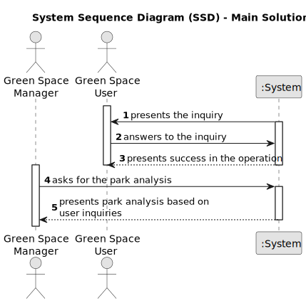

# US011 - View Park User Information

## 1. Requirements Engineering

### 1.1. User Story Description

As a Green Space Manager, I want to be able to collect data from the user portal
about the use of the park.

### 1.2. Customer Specifications and Clarifications 

**From the specifications document:**

> To analyse the use of the park by age groups,
a three-question survey was inserted in the user portal:

| Question                                        | Answer type                                                                                           |
|-------------------------------------------------|-------------------------------------------------------------------------------------------------------|
| Age range                                       | 1 - Child (up to 15 years old)  2 - Adult (beetwen 16 and 65 years old)  3 - Senior (over 65 years old) |
| Would you recommend the park to the others?     | Y/N                                                                                                   |
| How many times do you visit the park per month? | Numeric                                                                                               |

> The obtained responses are recorded in the ”Inquiry.csv” file. 
– Indicate the type of each of the three variables. 
– Indicate the proportion of users from each age group who would
recommend the park to others. 
– Create a boxplot for each age group, regarding the monthly frequency of use of the park, and draw the main conclusions obtained
from this type of graph.

> The green spaces management aims (within the available budget) to design,
build and maintain parks and gardens that meet the requirements of the
common citizen who wants to be informed. With this in mind, the objective
is to develop a Portal in which parks and garden users can post comments,
and report faults and malfunctions of equipment.

**From the client clarifications:**

> **Question:** None
>
> **Answer:** None

### 1.3. Acceptance Criteria

* **AC1:** All desired information is displayed to the user.
* **AC2:** The results derived from this information must be faithful and accurate to the information available in the Inquiry.csv file.

### 1.4. Found out Dependencies

* None

### 1.5 Input and Output Data

**Input Data:**

* None

**Output Data:**

* type of each variable in the survey's answer
* proportion of users from each age group who would recommend the park to others
* boxplot for each age group, regarding the monthly frequency of use of the park

### 1.6. System Sequence Diagram (SSD)

### 1.7 Other Relevant Remarks

* None