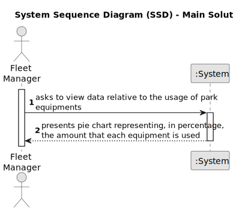

# US015 - New Park Average Monthly Cost Prediction

## 1. Requirements Engineering

### 1.1. User Story Description

As a ---, I want to predict the average monthly cost that will be
paid for water consumption in a new 55 hectare park.

### 1.2. Customer Specifications and Clarifications 

**From the specifications document:**

> The monthly cost associated with water consumption in each
park is related to its size. Consider the file ”water consumption updated.csv”
adapted from the file used in US09, in which the daily water consumption of more parks were inserted. The file ”Area.csv” has the area
(in hectares) of each park. Consider that the cost of water consumed
follows the rules defined in US09.

> The park management company is considering starting to manage a
new 55-hectare park. Predict the average monthly cost that will be
paid for water consumption in this new park. Apply the linear regression model, considering the park area as the independent variable and
the average monthly cost spent on water consumption as the response
variable. Start by studying the feasibility of linear adjustment.

**From the client clarifications:**

> **Question:** None.
>
> **Answer:** None.

### 1.3. Acceptance Criteria

* **AC1:** The pie chart is successfully created, accurately represents the registered data, and is presented to the user.

### 1.4. Found out Dependencies

* None.

### 1.5 Input and Output Data

**Input Data:**

* Area.csv file, with park name and its corresponding size;
* water_consumption_updated.csv file, with daily water consumption for each park.

**Output Data:**

* Float number, representing the prediction of the average monthly cost that will be paid.

### 1.6. System Sequence Diagram (SSD)

### 1.7 Other Relevant Remarks

* None