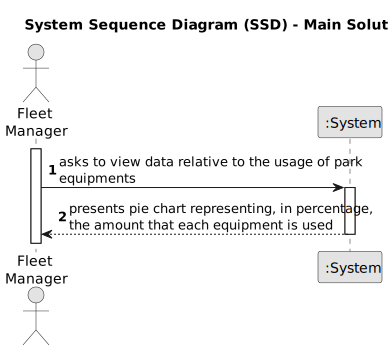

# US016 - Apply Polynomial Regression to US014 Data

## 1. Requirements Engineering

### 1.1. User Story Description

As a ---, I want to ---.

### 1.2. Customer Specifications and Clarifications 

**From the specifications document:**

> Consider the data and results associated with US14. Applying
polynomial regression, determine the best line that fits the data

**From the client clarifications:**

> **Question:** None.
>
> **Answer:** None.

### 1.3. Acceptance Criteria

* **AC1:** The pie chart is successfully created, accurately represents the registered data, and is presented to the user.

### 1.4. Found out Dependencies

* None.

### 1.5 Input and Output Data

**Input Data:**

* None

**Output Data:**

* Pie chart representing, in percentage, the data available in the EquipmentUsed.csv file.

### 1.6. System Sequence Diagram (SSD)

### 1.7 Other Relevant Remarks

* None