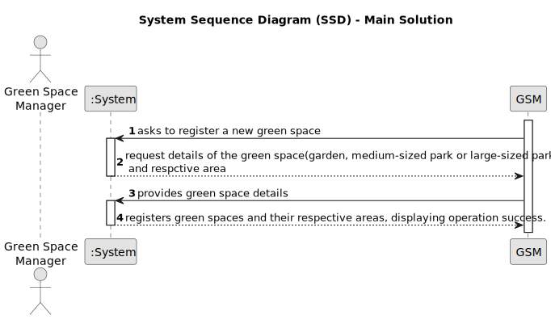

# US020 - Register Green Space and  respective area.

## 1. Requirements Engineering

### 1.1. User Story Description

As a Green Space Manager, I want to a new green space

### 1.2. Customer Specifications and Clarifications 

**From the specifications document:**
> The Green Space Manager should be able to input the name, type (garden, medium-sized park, or large-sized park), and area of each green space into the system.

> The system should store this information and confirm the successful registration of the green space..

**From the client clarifications:**

> **Question:**
To register a green space, what is the criteria needed to classify it as a medium-sized park or a large-sized park?
>
> **Answer:** It's a GSM responsability to decide the classification.

### 1.3. Acceptance Criteria

* **AC1:** The green space information (name, type, and area) is successfully stored in the system.
* **AC2:** A confirmation message is displayed upon successful registration of the green space.

### 1.4. Found out Dependencies

* None.

### 1.5 Input and Output Data

**Input Data:**

*Green space details for the new registration
**Output Data:**

* Confirmation of the new green space registered.

### 1.6. System Sequence Diagram (SSD)

### 1.7 Other Relevant Remarks

* None