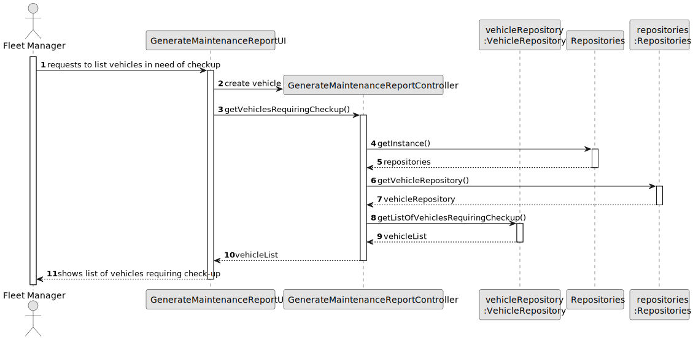
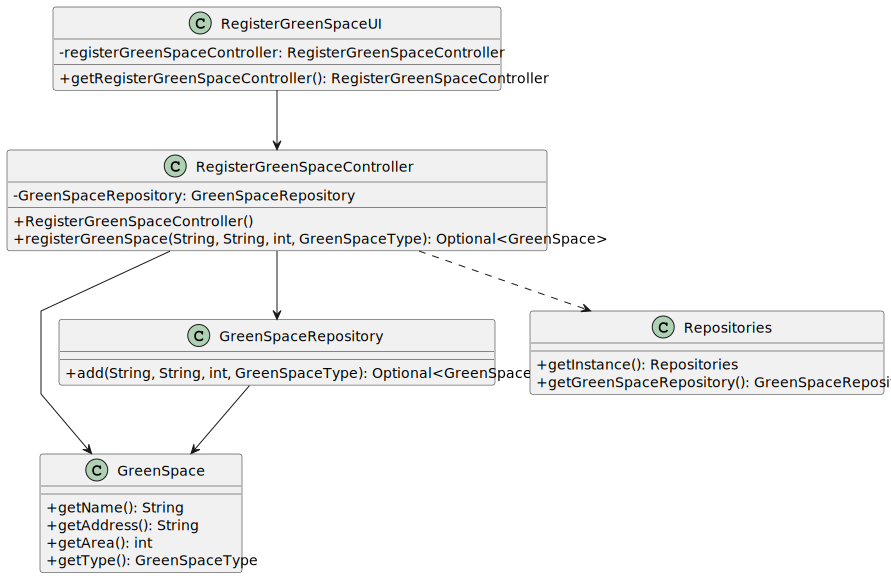

# US020 - Register a Green Space

## 3. Design - User Story Realization

### 3.1. Rationale

_**Note that SSD - Alternative One is adopted.**_

| Interaction ID | Question: Which class is responsible for...          | Answer                   | Justification (with patterns)                                                                                |
|:---------------|:-----------------------------------------------------|:-------------------------|:-------------------------------------------------------------------------------------------------------------|
| Step 1         | ... interacting with the actor?                      | RegisterGreenSpaceUI     | Pure Fabrication: there is no reason to assign this responsibility to any existing class in the Domain Model. |
| Step 2         | ... getting the current user session?                | AuthenticationRepository | IE: Responsible for managing user authentication data.                                                       |
| Step 3         | ... coordinating the US?                             | GreenSpaceController     | Controller                                                                                                   |
| Step 5         | ... getting the green space repository?              | GreenSpaceRepository     | IE: Acts as a repository factory.                                                                            |
| Step 6         | ... getting the green space type repository?         | GreenSpaceType           | IE: Acts as a repository factory.                                                                            |
| Step 7         | ... converting the data to DTO?                      | GreenSpaceMapper         | IE: Responsible for data transformation between objects and DTOs.                                            |
| Step 8         | ... registering the green space?                     | GreenSpaceRepository     | IE: Knows all green space data and handles the persistence of green spaces.                                  |
| Step 9         | ... creating and validating the green space object?  | GreenSpace               | IE: Domain object representing a green space.                                                                |
| Step 10        | ... representing the green space data?               | GreenSpaceDTO            | IE: Data Transfer Object for green space data.                                                               |
| Step 11		      | 	... informing operation success?                  | RegisterGreenSpaceUI     | IE: is responsible for user interactions.                                    |

### Systematization

According to the taken rationale, the conceptual classes promoted to software classes are:

* RegisterGreenSpaceUI
* GreenSpaceController
* AuthenticationRepository
* GreenSpaceRepository
* GreenSpaceMapper
* Repositories
* GreenSpaceType
* GreenSpace
* GreenSpaceDTO

Other software classes (i.e., Pure Fabrication) identified:

* None

## 3.2. Sequence Diagram (SD)

**Note that SSD - Alternative Two is adopted.**

### Full Diagram

This diagram shows the full sequence of interactions between the classes involved in the realization of this user story.

## 3.3. Class Diagram (CD)

