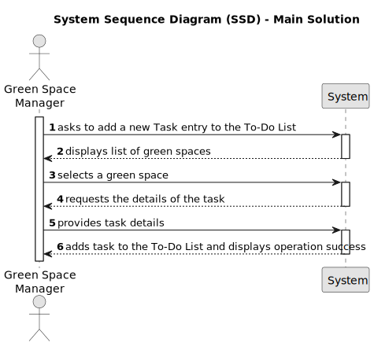

# US021 - Add New Entry to the To-do-list

## 1. Requirements Engineering

### 1.1. User Story Description

As a Green Space Manager, I want to add a new entry to the To-Do List.

### 1.2. Customer Specifications and Clarifications 

**From the specifications document:**

> The To-Do List comprises all the tasks required to be done in order to assure the proper functioning of the parks. These tasks can be regular (e.g. pruning trees) or occasional (e.g. repairing a broken equipment). They may also require a multi-disciplinary team and the length of the task can vary from a few minutes (e.g. replacing a light bulb) to weeks (e.g. installing an irrigation system).

> The entries in this list describe the required task, the degree of urgency (High, Medium, and Low), and the approximate expected duration.

**From the client clarifications:**

> **Question:** What time unit should be used for the duration of the task?.
>
> **Answer:** Hour and/or days.

### 1.3. Acceptance Criteria

* **AC1:**  The new entry must be associated with a green space managed by the GSM
* **AC2:**  The green space for the new entry should be chosen from a list presented to the GSM.

### 1.4. Found out Dependencies

* There is a dependency on "US20 - Register Green Space."

### 1.5 Input and Output Data

**Input Data:**

* Typed data: Task details for the new entry

**Output Data:**

* Confirmation that the new entry has been added to the To-Do List.

### 1.6. System Sequence Diagram (SSD)

### 1.7 Other Relevant Remarks

* The newly added entry to the To-Do List will have a default status of "Planned."