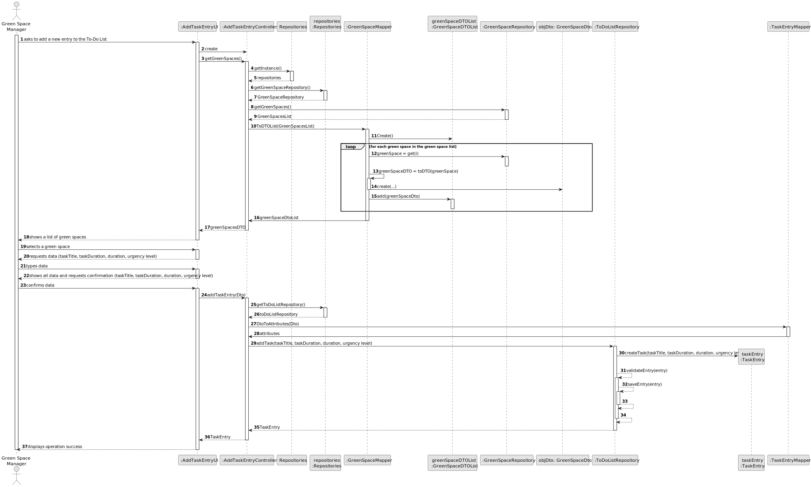
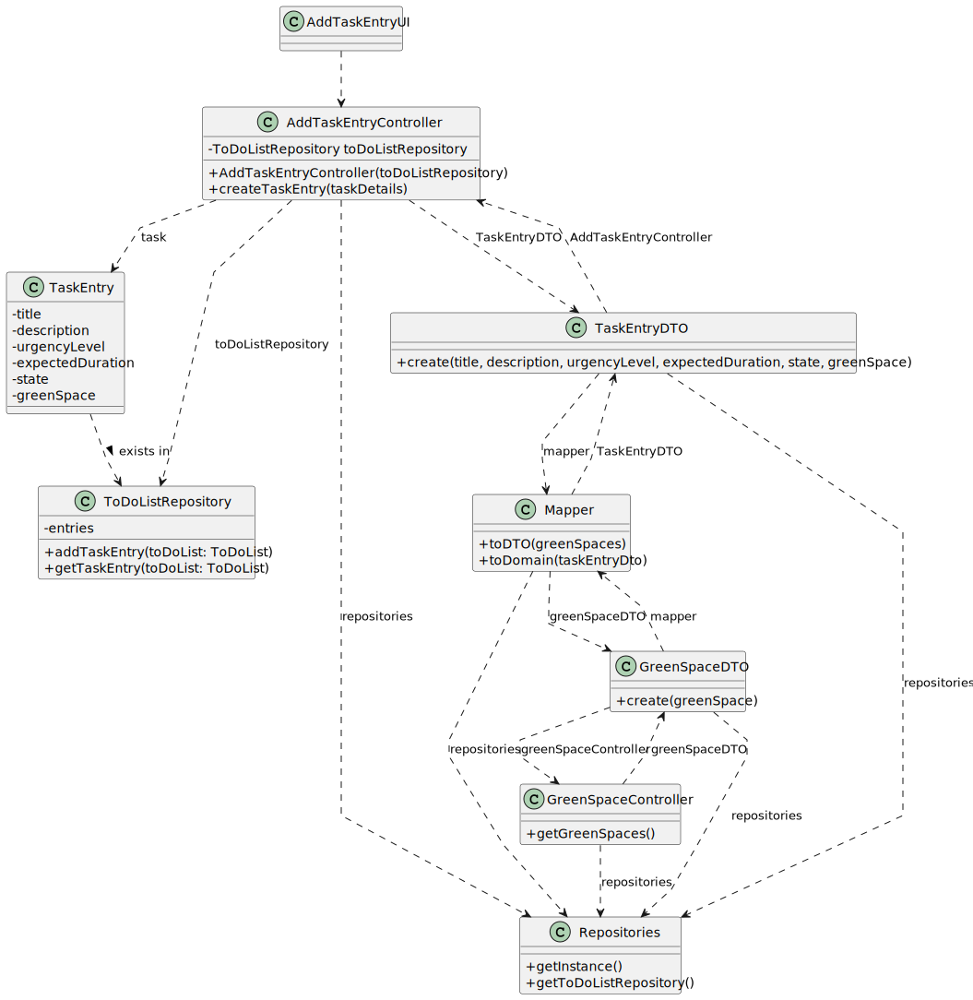

# US021 - Add new Entry to the To-do-list

## 3. Design - User Story Realization 

### 3.1. Rationale

_**Note that SSD - Alternative One is adopted.**_

| Interaction ID | Question: Which class is responsible for...           | Answer                 | Justification (with patterns)                                                                                 |
|:---------------|:------------------------------------------------------|:-----------------------|:--------------------------------------------------------------------------------------------------------------|
| Step 1  		     | 	... interacting with the actor?                      | AddTaskEntryUI         | Pure Fabrication: there is no reason to assign this responsibility to any existing class in the Domain Model. |
| 			            | 	... coordinating the US?                             | AddTaskEntryController | Controller                                                                                                    |
| Step 2  		     | ...Knowing the list of green spaces?                  | GreenSpaceRepository   | IE: Green spaces are recorded by the green space manager                                                      |
| 		             | 	...displaying all the data?                          | AddTaskEntryUI         | IE: Keeps all information before submission.                                                                  |
| Step 3 	    	  | 	...temporarily saving the inputted data?             | AddTaskEntryUI         | IE: Is responsible for saving the imputed data temporarily.                                                   |
| 		             | 	...requesting confirmation?                          | AddTaskEntryUI         | IE: Is responsible for user interactions.                                                                     |
| Step 4 		      | ...displaying the form for the user to imput data?    | AddTaskEntryUI         | IE:Is responsible for interacting with the actor.                                                             |
| Step 5		  	    | ...saving all data?                                   | TaskEntry              | IE: Has its own data.                                                                                         |
| 			  	         | 	... validating all data (local validation)?          | TaskEntry              | IE: owns all its data.                                                                                        |
| 			  	         | 	... validating all data (global validation)?         | ToDoListRepository     | IE: knows all tasks entries.                                                                                  |	| 	... saving the Created Check-up?                     | T                        | IE: owns all check-ups.                                                                                         |
| Step 6  		     | 	... informing operation success?                     | AddTaskEntryUI         | IE: is responsible for user interactions.                                                                     |
### Systematization ##

According to the taken rationale, the conceptual classes promoted to software classes are: 

* TaskEntry

Other software classes (i.e. Pure Fabrication) identified: 

* AddTaskEntryUI
* AddTaskEntryController
* ToDoListRepository
## 3.2. Sequence Diagram (SD)

### Full Diagram

This diagram shows the full sequence of interactions between the classes involved in the realization of this user story.

## 3.3. Class Diagram (CD)

