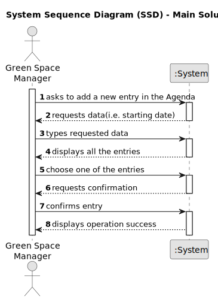

 # US022 - Add New Entry in the Agenda

## 1. Requirements Engineering

### 1.1. User Story Description

As a GSM, I want to add a new entry in the Agenda

### 1.2. Customer Specifications and Clarifications 

**From the specifications document:**

>  In the daily management, the GSM uses two essential tools: the Agenda and the Task List (aka To-Do List). The To-Do List comprises all the tasks required to be done in order to assure the proper functioning of the parks. These tasks can be regular (e.g. pruning trees) or occasional (e.g. repairing a broken equipment). They may also require a multi-disciplinary team and the length 15 of the task can vary from a few minutes (e.g. replacing a light bulb) to weeks (e.g. installing an irrigation system).

> The To-Do List comprises all pending tasks for all parks. The entries in this list describe the required task, the degree of urgency (High, Medium, and Low), and the approximate expected duration. The Agenda is made up of entries that relate to a task (which was previously in the To-Do List), the team that will carry out the task, the vehicles/equipment assigned to the task, expected duration, and the status (Planned, Postponed, Canceled, Done).

**From the client clarifications:**

> **Question:** Regarding the US022, when we are registering an entry to the agenda, are the three inputs (selecting an existing task from the to-do list, starting date, and finishing date) sufficient?
>
> **Answer:**
The starting date will be enough because the task already has the predicted duration.

> **Question:** Can I add an entry that has a time period that already have an existing entry in the Agenda?
>
> **Answer:** Yes, because there are many parks to manage and different tasks can be executed at same time in the same park.

> **Question:** When the GSM plans a task (that was previously in To-Do) into the Agenda, what aditional data/information does he need to input when planning?
>
> **Answer:** The starting date for the task. Later the GSM will be able to add the Team and vehicles (if required).

### 1.3. Acceptance Criteria

* **AC1:** The new entry must be associated with a green space managed by the GSM.
* **AC2:** The new entry must exist in the To-Do list.

### 1.4. Found out Dependencies

* There is a dependency on "US 21-" because the new entry must exist in the To-Do list

### 1.5 Input and Output Data

**Input Data:**

* Typed data:
   *  starting date

* Selected data:
   * entry
 

**Output Data:**

* (In)Success of the operation

### 1.6. System Sequence Diagram (SSD)

### 1.7 Other Relevant Remarks

* None