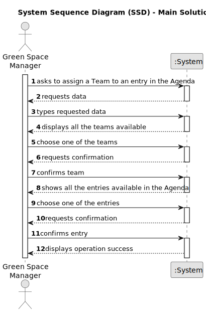

# US023 - Assign a Team to an Entry

## 1. Requirements Engineering

### 1.1. User Story Description

As a Green Space Manager, I want to assign a Team to an entry in the Agenda.

### 1.2. Customer Specifications and Clarifications 

**From the specifications document:**

> In the daily management, the GSM uses two essential tools: the Agenda and the Task List (aka To-Do List). The To-Do List comprises all the tasks required to be done in order to assure the proper functioning of the parks. These tasks can be regular (e.g. pruning trees) or occasional (e.g. repairing a broken  equipment). They may also require a multi-disciplinary team and the length of the task can vary from a few minutes (e.g. replacing a light bulb) to weeks (e.g. installing an irrigation system).

> The To-Do List comprises all pending tasks for all parks. The entries in this list describe the required task, the degree of urgency (High, Medium, and Low), and the approximate expected duration. The Agenda is made up of entries that relate to a task (which was previously in the To-Do List), the team that will carry out the task, the vehicles/equipment assigned to the task, expected duration, and the status (Planned, Postponed, Canceled, Done).

**From the client clarifications:**

> **Question:** Can an Agenda entry have more than one team assigned to it?
>
> **Answer:** No.

> **Question:** Can a Team be assigned to multiple entrys?
>
> **Answer:** Yes.

### 1.3. Acceptance Criteria

* **AC1:** A message must be sent to all team members informing
  them about the assignment.
* **AC2:** Different email services can send the message. These services must be defined through a configuration file to allow the use
  of different platforms (e.g. Gmail, DEI’s email service, etc.).

### 1.4. Found out Dependencies

* There is a dependency on "US 22- Add New Entry in the Agenda" because the entry must exist in the Agenda.

### 1.5 Input and Output Data

**Input Data:**
* Selected data:
    * entry
    * team

**Output Data:**

* (In)Success of the operation

### 1.6. System Sequence Diagram (SSD)

### 1.7 Other Relevant Remarks

* None