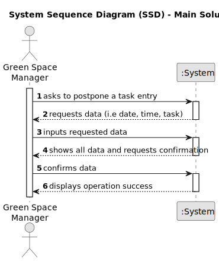

# US024 - Postpone Entry

## 1. Requirements Engineering

### 1.1. User Story Description

As a GSM, I want to Postpone an entry in the Agenda to a specific future date.
### 1.2. Customer Specifications and Clarifications 

**From the specifications document:**

> The Agenda is made up of entries that relate to a task (which was previously in the To-Do List), the team that will carry out the task, the vehicles/equipment assigned to
the task, expected duration, and the status (Planned, Postponed, Canceled,
Done).

**From the client clarifications:**

> **Question:** None.
>
> **Answer:** None.

### 1.3. Acceptance Criteria

* **AC1:** To postpone a task, it must have one of the following statuses: "Planned" or "Postponed".

### 1.4. Found out Dependencies

* There is a dependency on "US22 - Add New Entry in the Agenda"

### 1.5 Input and Output Data

**Input Data:**

* Typed data: Task to postpone, new date, new time.

**Output Data:**

* Confirmation that the task was postponed.

### 1.6. System Sequence Diagram (SSD)

### 1.7 Other Relevant Remarks

* None